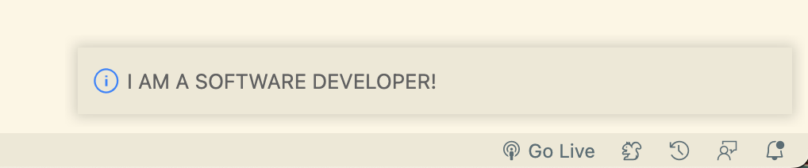
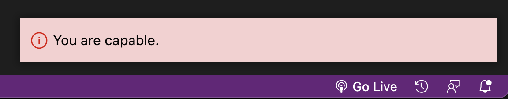
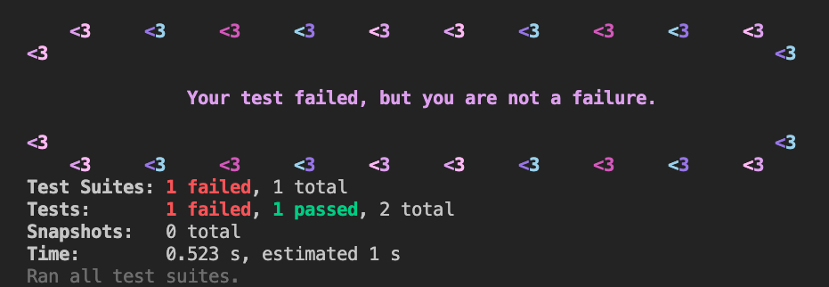
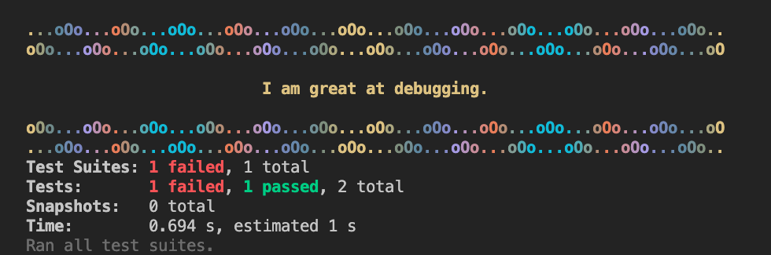

# **Error Affirmations Extension**

Error Affirmations is a VSCode extension that give you much needed code-related affirmations.
https://error-affirmations.netlify.app/

### **Preview**



## **Features**

### **Website**

A front-end experience where you can add your own affirmation to the database.
https://error-affirmations.netlify.app/

### **Pop Ups**

A general affirmation pops up on launch of VSCode.

This extension also offers a great addition to your VS Code notification window. An affirming, tranquil notification bar based on a hash of the root directory name when opened. It does this by immediately writing three colors to the following settings in `.vscode/settings.json`:

```javascript
  "workbench.colorCustomizations": {
    "notifications.border": "#000000",
    "notifications.background": "#f7d0d0",
    "notifications.foreground": "#060505",
    "statusBarItem.errorBackground": "#060505",
    "notificationsInfoIcon.foreground": "#de0000",
  }
```



### **Commands**

Throughout the day when you feel like you need an affirmation, you can fn+F1 to open the command palette and select an affirmation by category ("Get an error affirmation", "Get a TDD affirmation", or "Get a will to go on affirmation").

<br>

## **Check out our other app!**

#### **Error Affirmations** - Jest Reporter:

Error Affirmations Jest Reporter gives you much needed code-related affirmations in your terminal whenever your tests fail.

https://www.npmjs.com/package/error-affirmations

GitHub - https://github.com/VSCode-Empaths/VSCode-Affirmations-Jest-Reporter

<br>

### **Preview**



<br>

### Customize with **Color** and **Border** Themes!!!



<br>
## **Meet the team**

- Karl Wernsman - <a href="https://www.linkedin.com/in/karl-wernsman/" >LinkedIn</a>
- Kevin Nail - <a href="https://www.linkedin.com/in/kevinnail/" >LinkedIn</a>
- Rio Edwards - <a href="https://www.linkedin.com/in/rio-edwards/" >LinkedIn</a>
- Zach Sultan - <a href="https://www.linkedin.com/in/zachary-sultan/" >LinkedIn</a>
